# MacGyver Classroom Database ERD

Source docs: `docs/macgyver-classroom-srs.md`, `docs/macgyver-classroom-system-design.md`, and feature PRDs `features/01` through `features/12`.

## Processing Flow

```text
Visitor -> Lead
Teacher -> User/Session -> TeacherProfile/OrganizationMember
Teacher -> InventoryScan -> ScanImage/DetectedItem -> ConfirmedItem
ConfirmedItem -> Material/MaterialProperty/SafetyRule
InventoryScan + Material -> ExperimentMatch -> ExperimentTemplate
ExperimentMatch -> LessonPlan -> LessonPlanVersion -> LessonExport/ShareLink
SafetyCheckResult gates ExperimentMatch, LessonPlan, and LessonExport
Feedback, AnalyticsEvent, ReviewNote, ContentStatusHistory, and AuditLog observe or moderate the full workflow
```

## ERD

```mermaid
erDiagram
  Organization ||--o{ OrganizationMember : has
  User ||--o{ OrganizationMember : joins
  User ||--o{ Session : owns
  User ||--o| TeacherProfile : configures
  Organization ||--o{ TeacherProfile : scopes

  User ||--o{ InventoryScan : creates
  Organization ||--o{ InventoryScan : owns
  InventoryScan ||--o{ ScanImage : includes
  MediaAsset ||--o{ ScanImage : backs
  StorageObjectRef ||--o{ MediaAsset : stores
  InventoryScan ||--o{ DetectedItem : produces
  ScanImage ||--o{ DetectedItem : detects
  InventoryScan ||--o{ ConfirmedItem : confirms
  DetectedItem ||--o{ ConfirmedItem : corrected_as
  Material ||--o{ DetectedItem : normalizes
  Material ||--o{ ConfirmedItem : maps

  Material ||--o{ MaterialAlias : aliases
  Material ||--o{ MaterialProperty : describes
  Material ||--o{ MaterialAlternative : source
  Material ||--o{ MaterialAlternative : substitute
  Material ||--o{ SafetyRule : constrained_by

  ExperimentTemplate ||--o{ ExperimentMaterialRequirement : requires
  Material ||--o{ ExperimentMaterialRequirement : satisfies
  ExperimentTemplate ||--o{ ExperimentStep : orders
  ExperimentTemplate ||--o{ ExperimentSafetyNote : warns
  CurriculumStandard ||--o{ ExperimentCurriculumMapping : maps
  ExperimentTemplate ||--o{ ExperimentCurriculumMapping : aligns

  InventoryScan ||--o{ ExperimentMatch : generates
  ExperimentTemplate ||--o{ ExperimentMatch : suggested
  User ||--o{ ExperimentMatch : requested
  Organization ||--o{ ExperimentMatch : scopes

  ExperimentTemplate ||--o{ LessonPlan : sources
  ExperimentMatch ||--o{ LessonPlan : selected_for
  InventoryScan ||--o{ LessonPlan : uses_inventory
  User ||--o{ LessonPlan : owns
  Organization ||--o{ LessonPlan : scopes
  LessonPlan ||--o{ LessonPlanVersion : versions
  LessonPlanVersion ||--o{ LessonExport : exported_as
  LessonPlan ||--o{ LessonExport : exports
  StorageObjectRef ||--o{ LessonExport : artifact

  AiPromptVersion ||--o{ AiRun : versions
  User ||--o{ AiRun : requests
  Organization ||--o{ AiRun : scopes
  InventoryScan ||--o{ AiRun : analyzes
  ExperimentMatch ||--o{ AiRun : scores
  LessonPlan ||--o{ AiRun : generates

  SafetyRule ||--o{ SafetyCheckResult : evaluated_in
  User ||--o{ SafetyCheckResult : confirms
  InventoryScan ||--o{ SafetyCheckResult : checks
  ExperimentMatch ||--o{ SafetyCheckResult : checks
  LessonPlan ||--o{ SafetyCheckResult : checks
  LessonExport ||--o{ SafetyCheckResult : gates
  AiRun ||--o{ SafetyCheckResult : validates

  Lead ||--o{ LeadEvent : tracked_by
  User ||--o{ LeadEvent : records
  User ||--o{ Feedback : submits
  Organization ||--o{ Feedback : scopes
  LessonPlan ||--o{ Feedback : receives
  ExperimentTemplate ||--o{ Feedback : receives
  AiRun ||--o{ Feedback : receives
  User ||--o{ AnalyticsEvent : emits
  Organization ||--o{ AnalyticsEvent : scopes

  User ||--o{ ReviewNote : reviews
  User ||--o{ ContentStatusHistory : changes
  User ||--o{ AuditLog : acts
```



## Modeling Notes

- `OrganizationMember` is the tenant boundary for roles. Teacher-owned objects still carry `organizationId` for query isolation and school-level aggregates.
- `StorageObjectRef` is the private Supabase object pointer. `MediaAsset` wraps storage metadata and consent. `ScanImage` uses `MediaAsset` so image retention can evolve without changing scan rows.
- Curated content uses `ContentStatus` plus generic `ReviewNote`, `ContentStatusHistory`, and `AuditLog` because admin workflows span experiments, materials, curriculum, safety rules, leads, and feedback.
- `SafetyCheckResult` is intentionally reusable. It gates matching, generation, and export, and stores evaluated rule results as JSON.
- `AnalyticsEvent` and `Feedback` use target/entity fields plus optional typed foreign keys for high-value targets. Event properties must not store raw images, tokens, OAuth IDs, or full exported lesson bodies.
