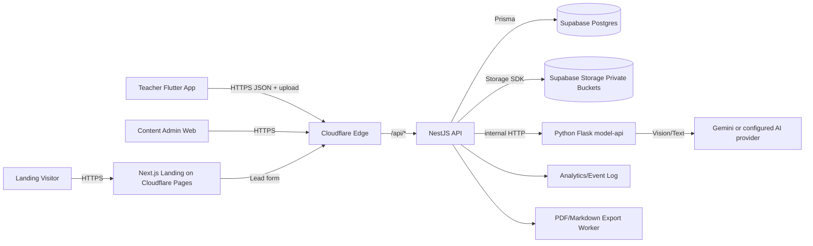
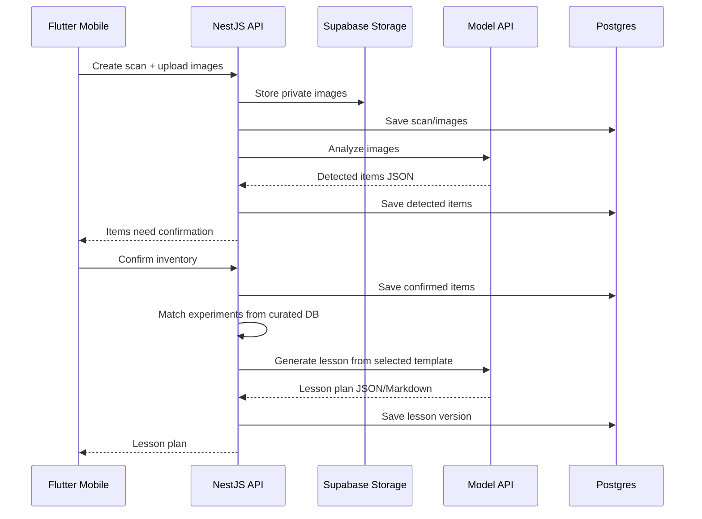

# MacGyver Classroom - System Design

Phiên bản: 0.1
Ngày: 2026-05-15
Trạng thái: Draft mới cho dự án MacGyver Classroom

## 1. Mục tiêu tài liệu

Tài liệu này là bản thiết kế hệ thống mới cho MacGyver Classroom, được tổng hợp sau khi review Cityfarm2.0 bằng 10 lát cắt độc lập:

- Monorepo/workspace
- NestJS API
- Prisma/Supabase data layer
- Python model-api/AI
- User-facing web app
- Admin app
- Landing page
- Deployment/infrastructure
- Auth/security/storage
- Design system/frontend visual implementation

Mục tiêu không phải copy Cityfarm2.0, mà là lấy pattern tốt và tránh các lỗi đã thấy: doc drift, public storage, thiếu migration history, thiếu OpenAPI, circular module, env drift, hardcoded colors, landing visual quá nặng.

## 2. Product Context

MacGyver Classroom là sản phẩm AI dành cho giáo viên STEM/Vật lý/Công nghệ THCS-THPT. Giáo viên chụp ảnh vật dụng cũ trong trường, AI nhận diện vật phẩm, ánh xạ tính chất STEM, match với database thí nghiệm curated, rồi sinh giáo án 45 phút theo định hướng GDPT 2018.

Luồng lõi:

```text
Ảnh vật dụng -> Vision Catalog -> Property Mapping -> Experiment Match -> Lesson Plan Generation
```

Sản phẩm gồm:

- Mobile app Flutter cho giáo viên.
- Landing page giới thiệu và thu lead pilot.
- Admin/content portal để quản lý thí nghiệm curated.
- NestJS API làm business backend.
- Supabase Postgres + Supabase Storage.
- Python model-api cho AI vision/LLM.
- Cloudflare cho DNS, CDN, Pages, routing, WAF/rate limiting và deployment edge.

## 3. Kiến trúc tổng quan



Nguyên tắc:

- Mobile app không gọi Supabase service role trực tiếp.
- Model-api không ghi DB trực tiếp; API là owner của transaction và authorization.
- AI output luôn được normalize và validate trước khi lưu.
- Thí nghiệm MVP phải đến từ curated database; LLM không tự bịa thí nghiệm ngoài danh mục.
- Storage mặc định private; truy cập bằng signed URL hoặc API proxy.

## 4. Monorepo Layout

Đề xuất repo mới:

```text
macgyver-classroom/
├── apps/
│   ├── mobile/                 # Flutter app
│   ├── landing/                # Next.js landing page
│   ├── admin/                  # Next.js content/admin portal
│   ├── api/                    # NestJS REST API
│   └── model-api/              # Python Flask AI service
├── packages/
│   ├── design-tokens/          # JSON tokens, generated CSS/Dart outputs
│   ├── eslint-config/          # Shared TS lint config
│   ├── typescript-config/      # Shared TS config
│   ├── api-contracts/          # OpenAPI generated types/client
│   └── ui/                     # Optional shared React primitives for landing/admin
├── docs/
│   ├── macgyver-classroom-prd.md
│   ├── macgyver-classroom-brd.md
│   ├── macgyver-classroom-frs.md
│   ├── macgyver-classroom-srs.md
│   ├── macgyver-classroom-system-design.md
│   └── macgyver-classroom-design-system.md
├── infra/
│   ├── cloudflare/
│   └── deploy/
└── docker/
    ├── api.Dockerfile
    └── model-api.Dockerfile
```

Kế thừa từ Cityfarm2.0:

- Giữ `apps/*` và `packages/*` rõ ràng.
- Giữ root scripts mỏng: `dev`, `build`, `lint`, `check-types`, `test`.
- Giữ service riêng cho AI để API không bị khóa vào SDK/provider AI.

Điều chỉnh:

- Flutter không bị ép vào output model của Next.js/Turbo.
- `landing` phải được ghi rõ trong repo tree để tránh doc drift.
- Turbo outputs phải tách theo app type, không dùng `.next/**` cho mọi workspace.

## 5. Deployable Services

| Service          | Runtime      | Trách nhiệm                                         | Public               |
| ---------------- | ------------ | --------------------------------------------------- | -------------------- |
| `apps/mobile`    | Flutter      | Teacher app Android/iOS                             | Store/TestFlight/APK |
| `apps/landing`   | Next.js      | Marketing, pilot lead, product demo                 | Có                   |
| `apps/admin`     | Next.js      | Quản trị thí nghiệm, lead, feedback                 | Có, protected        |
| `apps/api`       | NestJS       | Auth, business logic, DB, storage, AI orchestration | Có qua `/api/*`      |
| `apps/model-api` | Python Flask | Vision catalog, LLM generation, normalization       | Không public         |

Port local đề xuất:

| Service   | Port   |
| --------- | ------ |
| Landing   | `3000` |
| Admin     | `3002` |
| API       | `3001` |
| Model API | `3003` |

## 6. API Architecture

NestJS API dùng module/controller/provider pattern.

```text
apps/api/src/
├── app.module.ts
├── main.ts
├── auth/
├── users/
├── organizations/
├── inventory/
├── materials/
├── experiments/
├── lessons/
├── curriculum/
├── assets/
├── ai/
├── leads/
├── analytics/
├── admin/
├── prisma/
└── common/
```

### Modules

| Module          | Trách nhiệm                                                                 |
| --------------- | --------------------------------------------------------------------------- |
| `auth`          | Email/password, Google OAuth, JWT access/refresh, mobile bearer, web cookie |
| `users`         | User profile, teacher profile                                               |
| `organizations` | Trường, tổ chuyên môn, membership, role                                     |
| `inventory`     | Scan session, detected items, confirmed items                               |
| `materials`     | Canonical material, property mapping, safe alternatives                     |
| `experiments`   | Curated experiment templates, matching engine                               |
| `lessons`       | Lesson plan generation, editor state, export                                |
| `curriculum`    | GDPT 2018 metadata, grade/subject/topic mapping                             |
| `assets`        | Private upload, signed URL, metadata                                        |
| `ai`            | Client gọi model-api, prompt contracts, retry/fallback                      |
| `leads`         | Landing page pilot lead capture                                             |
| `analytics`     | Product events, usage metrics                                               |
| `admin`         | Content curation, moderation queue, audit trail                             |
| `common`        | Guards, decorators, filters, interceptors, validation                       |

### API bootstrap requirements

- `ValidationPipe({ whitelist: true, transform: true, forbidNonWhitelisted: true })`.
- CORS fail-closed ở production: bắt buộc `WEB_ORIGINS`, `ADMIN_ORIGINS`, `LANDING_ORIGINS`.
- Global exception filter không leak raw provider errors.
- Request ID middleware.
- OpenAPI/Swagger bắt buộc cho mobile/admin contracts.
- Rate limiting cho auth, upload, AI analysis, lead form.

### Auth pattern

Kế thừa pattern tốt từ Cityfarm2.0:

- Web/admin: httpOnly cookies.
- Mobile: bearer access token + refresh token lưu trong Keychain/Keystore/Secure Storage.
- Access token ngắn hạn.
- Refresh token được hash trong DB và rotate khi refresh.
- Guards/decorators chuẩn: `JwtAuthGuard`, `RolesGuard`, `@CurrentUser`, `@Roles`.

Bổ sung cho MacGyver:

- CSRF token hoặc strict Origin check cho cookie-auth state-changing routes.
- Google OAuth chỉ link khi email đã verified.
- Session/device table để revoke theo thiết bị.
- Login/upload/AI endpoint throttling.

## 7. Data Architecture

Supabase Postgres là source of truth. Prisma quản lý schema và migration.

Quy định:

- Runtime API dùng pooled `DATABASE_URL`.
- Migration dùng direct `DIRECT_URL`.
- Bắt buộc có `prisma/migrations`.
- Không dùng schema diff file thay cho migration history.
- Seed data chia theo domain và có verification script.

### Core entity groups

| Group         | Entities                                                                                        |
| ------------- | ----------------------------------------------------------------------------------------------- |
| Identity      | `User`, `TeacherProfile`, `Organization`, `OrganizationMember`, `Session`                       |
| Inventory     | `InventoryScan`, `ScanImage`, `DetectedItem`, `ConfirmedItem`                                   |
| Materials     | `Material`, `MaterialProperty`, `MaterialAlias`, `MaterialAlternative`                          |
| Experiments   | `ExperimentTemplate`, `ExperimentMaterialRequirement`, `ExperimentStep`, `ExperimentSafetyNote` |
| Curriculum    | `CurriculumStandard`, `ExperimentCurriculumMapping`                                             |
| Lessons       | `LessonPlan`, `LessonPlanVersion`, `LessonExport`                                               |
| AI            | `AiRun`, `AiPromptVersion`, `ExperimentMatch`, `SafetyCheckResult`                              |
| Content Admin | `ReviewNote`, `AuditLog`, `ContentStatusHistory`                                                |
| Assets        | `MediaAsset`, `StorageObjectRef`                                                                |
| Growth        | `Lead`, `LeadEvent`, `AnalyticsEvent`, `Feedback`                                               |

### Important state machines

```text
ExperimentTemplate: DRAFT -> IN_REVIEW -> PUBLISHED -> ARCHIVED
InventoryScan: CREATED -> UPLOADED -> ANALYZING -> NEEDS_CONFIRMATION -> CONFIRMED -> FAILED
LessonPlan: DRAFT -> GENERATED -> EDITED -> EXPORTED -> ARCHIVED
Lead: NEW -> CONTACTED -> PILOT_SCHEDULED -> PILOT_ACTIVE -> CLOSED
AiRun: QUEUED -> RUNNING -> SUCCEEDED -> FAILED -> CANCELLED
```

### Storage model

Private Supabase buckets:

| Bucket           | Nội dung                              | Access                      |
| ---------------- | ------------------------------------- | --------------------------- |
| `scan-images`    | Ảnh vật dụng giáo viên upload         | Private signed URL          |
| `lesson-exports` | PDF/Markdown export                   | Private signed URL          |
| `content-assets` | Ảnh minh họa thí nghiệm/admin content | Private or public-by-policy |

Upload flow:

1. API nhận multipart upload.
2. Validate size, MIME, magic bytes, pixel count.
3. Strip metadata nếu là ảnh classroom/student-sensitive.
4. Upload vào object key có namespace: `org/{orgId}/user/{userId}/scan/{scanId}/{uuid}.jpg`.
5. Tạo `MediaAsset` metadata row.
6. Nếu DB write fail, API xóa object để tránh orphan.

## 8. AI Architecture

Model-api giữ pattern route mỏng/handler dày từ Cityfarm2.0, nhưng contract hóa chặt hơn.

```text
POST /internal/vision/catalog
POST /internal/materials/map-properties
POST /internal/lessons/generate
POST /internal/safety/check
GET  /ready
```

### Pipeline



### AI contracts

Vision Catalog response:

```json
{
  "items": [
    {
      "raw_label": "plastic bottle",
      "canonical_name": "chai nhua",
      "quantity_estimate": 3,
      "confidence": 0.82,
      "evidence": "visible on shelf, blue caps",
      "safety_flags": []
    }
  ]
}
```

Lesson Plan response:

```json
{
  "title": "Thí nghiệm áp suất không khí bằng chai nhựa",
  "duration_minutes": 45,
  "grade_band": "THCS",
  "objectives": [],
  "materials": [],
  "lesson_flow": [],
  "guiding_questions": [],
  "assessment": [],
  "safety_notes": [],
  "teacher_checks_required": []
}
```

Guardrails:

- Model IDs nằm trong config/env, không hard-code preview model.
- LLM output phải parse JSON được và pass schema validation.
- Mọi output có safety note.
- AI không thêm vật liệu ngoài template nếu chưa qua safety rule.
- Error response không trả raw exception/provider stack.
- Model-api test bắt buộc cho invalid image, provider failure, JSON normalization.

## 9. Experiment Matching

Matching engine nằm trong NestJS API, không nằm hoàn toàn trong LLM.

Scoring đề xuất:

| Factor                       | Weight |
| ---------------------------- | ------ |
| Required materials available | 40     |
| Safe alternatives available  | 15     |
| Grade/subject/topic fit      | 20     |
| Duration <= 45 minutes       | 10     |
| Safety level suitable        | 10     |
| Teacher profile preference   | 5      |

LLM chỉ hỗ trợ:

- Diễn giải lý do đề xuất.
- Sinh lesson plan từ template đã match.
- Gợi ý cách trình bày phù hợp lớp học.

## 10. Admin/Content Architecture

Admin kế thừa pattern queue từ Cityfarm2.0 nhưng phải có persistence đầy đủ.

Admin modules:

```text
admin/
├── experiments/
├── materials/
├── curriculum/
├── safety-rules/
├── leads/
├── feedback/
└── audit/
```

Admin requirements:

- Server page load initial data, client console xử lý filter/detail/edit.
- Real pagination/filter/sort, không chỉ `limit`.
- Status transitions persisted.
- Review notes persisted.
- Reviewer ID + timestamp persisted.
- Audit log cho mọi thay đổi Published content.
- Optimistic UI phải rollback khi PATCH fail.
- Role-gated e2e tests.

## 11. Landing Architecture

Landing page dùng Next.js trên Cloudflare Pages.

Conversion arc:

1. Hero: one-liner rõ cho giáo viên/trường học.
2. Product proof: ảnh tủ đồ -> danh mục vật phẩm -> 5 thí nghiệm -> giáo án.
3. Pipeline 4 bước.
4. Safety and curriculum trust section.
5. Use cases theo giáo viên/tổ chuyên môn/ban giám hiệu.
6. Pilot lead form.

Không copy Cityfarm:

- Không dùng custom cursor.
- Không dùng visual ambient quá nặng.
- Không CTA bằng `mailto` duy nhất.
- Có lead form thật, validation, success/error state.
- Có analytics events.
- Có Open Graph/Twitter metadata.

## 12. Mobile Flutter Architecture

Flutter app là primary product surface.

Đề xuất app layers:

```text
lib/
├── app/
│   ├── router/
│   ├── theme/
│   └── providers/
├── features/
│   ├── auth/
│   ├── onboarding/
│   ├── capture/
│   ├── inventory/
│   ├── experiments/
│   ├── lessons/
│   ├── library/
│   └── settings/
├── shared/
│   ├── api/
│   ├── storage/
│   ├── widgets/
│   └── errors/
└── generated/
    └── api_client/
```

Navigation:

- Bottom nav: Home, Scan, Library, Community/Feedback, Account.
- Primary capture action prominent in center or main tab.
- Safe-area aware bottom actions.
- Offline draft for lesson edits.

Mobile security:

- Refresh token in Keychain/Keystore/Secure Storage.
- Access token in memory where possible.
- Queued refresh to avoid refresh storms.
- Upload requires explicit user action and consent.

## 13. Cloudflare Deployment

Cloudflare responsibilities:

- DNS and custom domains.
- Cloudflare Pages for landing/admin where feasible.
- Workers for edge gateway, redirects, rate limiting, lightweight lead webhook if needed.
- WAF/rate limiting for `/api/*`, `/auth/*`, `/assets/*`, `/ai/*`.
- Preview deployments for landing/admin.
- Secrets and vars separated per environment.

Important runtime decision:

- Do not assume NestJS/Express runs directly on Workers without adaptation.
- API/model-api can use Cloudflare Containers if project supports it.
- Fallback: container host/VPS behind Cloudflare Tunnel or Load Balancer.

### Environment matrix

| Env           | Purpose            |
| ------------- | ------------------ |
| `development` | Local dev          |
| `staging`     | QA/pilot rehearsal |
| `production`  | Real schools/users |

Public variables:

- `NEXT_PUBLIC_API_URL`
- `NEXT_PUBLIC_APP_URL`
- `NEXT_PUBLIC_ADMIN_URL`
- `NEXT_PUBLIC_LANDING_URL`

Server secrets:

- `DATABASE_URL`
- `DIRECT_URL`
- `SUPABASE_URL`
- `SUPABASE_SERVICE_ROLE_KEY`
- `SUPABASE_BUCKET_SCAN_IMAGES`
- `JWT_ACCESS_SECRET`
- `JWT_REFRESH_SECRET`
- `GOOGLE_CLIENT_ID`
- `GOOGLE_CLIENT_SECRET`
- `MODEL_API_URL`
- `MODEL_API_AUTH_TOKEN`
- `AI_PROVIDER_API_KEY` or provider-specific service credential

Rules:

- Frontend services never receive backend secrets.
- Env names are canonical; avoid duplicate aliases.
- Post-deploy smoke test checks `/ready`, auth route, lead form route and one public landing URL.

## 14. Observability

Required logs/events:

- `request_id`
- `user_id`, `org_id` where allowed
- `scan_id`, `lesson_plan_id`, `ai_run_id`
- AI latency, token/image cost estimate
- Storage object key only, not public URL
- Safety rule decisions
- Admin publish/archive actions

Metrics:

- Scan success rate
- Vision item confirmation accuracy
- Experiment match selected rate
- Lesson generation success rate
- Export rate
- Lead conversion rate
- AI failure/retry rate

## 15. Testing Strategy

### API

- Unit: matching, safety filtering, DTO validation, token extraction.
- Integration: auth flow, upload flow, signed URL, AI mocked lesson generation.
- E2E: teacher scan -> confirm -> match -> generate -> export.

### Model API

- Invalid image.
- Oversized image.
- Provider timeout.
- Non-JSON model response.
- Normalization of Vietnamese/English material names.

### Mobile

- Auth refresh queue.
- Camera permission denied.
- Upload retry.
- Lesson editor draft save.
- Dark/light theme snapshot.

### Admin

- Role gate.
- Publish/archive transition.
- Review note persistence.
- Audit log creation.
- Optimistic rollback.

### Landing

- Lead form validation.
- SEO metadata.
- Analytics event dispatch.
- Reduced-motion behavior.

## 16. Key Decisions

| Decision     | Choice                                                                            |
| ------------ | --------------------------------------------------------------------------------- |
| Main client  | Flutter mobile app                                                                |
| Public web   | Next.js landing page                                                              |
| Admin web    | Next.js protected portal                                                          |
| Backend      | NestJS REST API                                                                   |
| DB           | Supabase Postgres with Prisma migrations                                          |
| Storage      | Supabase private buckets + signed URLs                                            |
| AI           | Python Flask model-api with Gemini/provider abstraction                           |
| Deployment   | Cloudflare Pages/Workers/Edge plus Containers or container host behind Cloudflare |
| API contract | OpenAPI generated clients                                                         |
| Theme        | White + ocean blue light theme, dark theme generated from semantic tokens         |

## 17. Risks And Mitigations

| Risk                             | Mitigation                                                         |
| -------------------------------- | ------------------------------------------------------------------ |
| AI nhận diện sai vật phẩm        | Giáo viên xác nhận inventory trước matching                        |
| AI sinh thí nghiệm không an toàn | Curated templates + safety rules + admin review                    |
| Ảnh lớp học nhạy cảm             | Private storage, metadata stripping, signed URLs, retention policy |
| Cloudflare runtime mismatch      | Tách Pages/Workers khỏi containerized API/model runtime            |
| Chi phí AI tăng                  | Cache scan result, matching deterministic, quota per org           |
| Content quality thấp             | Admin review workflow + audit + feedback                           |
| Doc drift                        | Repo tree, env matrix, route map cập nhật cùng PR                  |

## 18. Open Questions

- Dùng Gemini trực tiếp hay Vertex AI như Cityfarm2.0?
- Admin portal có vào MVP hay seed nội dung bằng script trước?
- Lesson export render ở Flutter hay backend?
- Có cần multi-tenant billing ngay trong pilot không?
- Retention policy cho scan images: 30, 90 hay 180 ngày?
